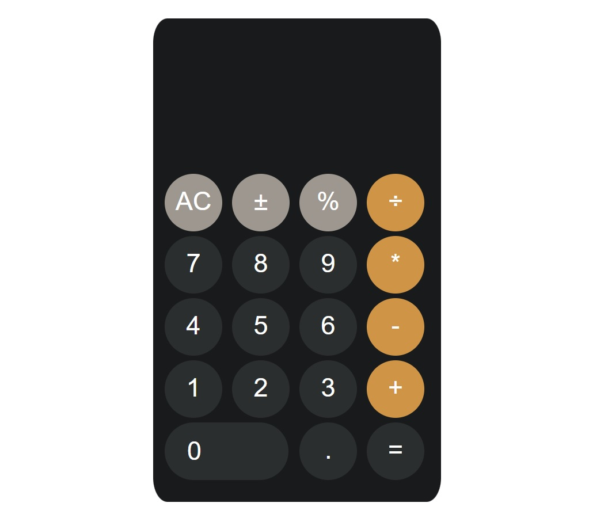

# Calculator

This project creates a simple calculator interface using HTML and CSS. The calculator is designed to perform basic arithmetic operations.

## Features

- Basic calculation operations: addition, subtraction, multiplication, division
- Clearing, positive/negative change and percentage calculation functions
- A modern and user-friendly interface

## Technologies

- HTML
- CSS

# Hesap Makinesi

Bu proje, HTML ve CSS kullanarak basit bir hesap makinesi arayüzü oluşturmaktadır. Hesap makinesi, temel aritmetik işlemleri gerçekleştirmek için tasarlanmıştır.

## Özellikler

- Temel hesaplama işlemleri: toplama, çıkarma, çarpma, bölme
- Temizleme, pozitif/negatif değişim ve yüzde hesaplama işlevleri
- Modern ve kullanıcı dostu bir arayüz

## Teknolojiler

- HTML
- CSS

[Canlı Demo'yu Deneyin](https://fatihycan.github.io/calculator/)
